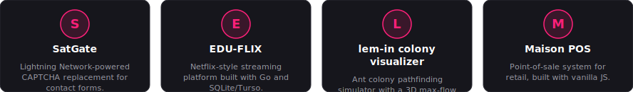

<div align="center">


# Eddy Odero

### Full-stack developer | Go, SQLite, vanilla JS | Kisumu, Kenya

   

</div>

---

<div align="center">

<sub>The terminal below is just flavor - here's the plain-language version first.</sub>

</div>

### Tech Stack

`Go` `JavaScript` `SQLite` `PostgreSQL` `Docker` `Python` 
### Projects

<div align="center">



</div>

### A quote I like

<div align="center">


</div>

---

<div align="center">

**Status:** `Reading Documentation` _



<sub>Live-ish terminal flair - avatar, boot log, and status re-render every build.</sub>

</div>

---

### `$ github --stats`

```
Repositories : 24
Stars        : 37
Followers    : 12
Contributions: N/A
Top Languages: Go, JavaScript, Python
Pinned       : SatGate, EDU-FLIX, lem-in
```

### `$ github --activity`

```
pushed to profile-engine
```

### `$ leetcode --stats`

```
Solved       : 120 (Easy 55 / Medium 50 / Hard 15)
Rating       : unrated
Global Rank  : N/A
Top %        : N/A
Contests     : 0
Badges       : none yet
```


---

<sub>Last rendered: 2026-07-22 12:12 UTC · theme: cyberpunk · auto-generated, do not edit by hand</sub>