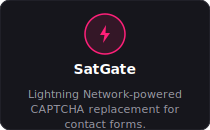
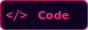
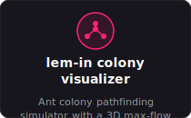
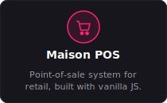

<div align="center">


<sub>~ live session · Eddy Odero@github · re-renders every build ~</sub>

   

</div>

---

### Tech Stack

<div align="center">


**Tools**


</div>

### Projects

<table>
<tr>
<td align="center" width="220">



<table><tr>
<td align="left"><br><sub>not hosted yet</sub></td>
<td align="right">[](https://github.com/Eddy-Odero/SatGate)</td>
</tr></table>

</td>
<td align="center" width="220">


<table><tr>
<td align="left"><br><sub>not hosted yet</sub></td>
<td align="right">[](https://github.com/Eddy-Odero/EDU-FLIX)</td>
</tr></table>

</td>
<td align="center" width="220">



<table><tr>
<td align="left"><br><sub>not hosted yet</sub></td>
<td align="right">[](https://github.com/Eddy-Odero/lem-in)</td>
</tr></table>

</td>
<td align="center" width="220">



<table><tr>
<td align="left"><br><sub>not hosted yet</sub></td>
<td align="right">[](https://github.com/Eddy-Odero/Maison-POS)</td>
</tr></table>

</td>
</tr>
</table>

### A quote I like

<div align="center">


</div>

---

### `$ github --stats`

```
Repositories : 24
Stars        : 37
Followers    : 12
Contributions: N/A
Top Languages: Go, JavaScript, Python
Pinned       : SatGate, EDU-FLIX, lem-in
```

### `$ github --activity`

```
pushed to profile-engine
```

### `$ leetcode --stats`

```
Solved       : 120 (Easy 55 / Medium 50 / Hard 15)
Rating       : unrated
Global Rank  : N/A
Top %        : N/A
Contests     : 0
Badges       : none yet
```


---

<<<<<<< HEAD
<sub>Last rendered: 2026-07-24 02:58 UTC · theme: cyberpunk · auto-generated, do not edit by hand</sub>
=======
<sub>Last rendered: 2026-07-24 08:06 UTC · theme: cyberpunk · auto-generated, do not edit by hand</sub>
>>>>>>> e5b196362b350d78a8845c632d16cd4f78b9a8c9
