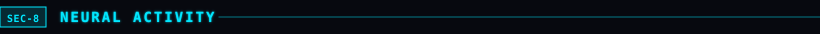

~ live session · Eddy Odero@github · re-renders every build ~

   

---

<table>
<tr>
<td align="center" width="360">

</td>
<td align="center" width="360">

</td>
</tr>
<tr>
<td align="center" width="360">

</td>
<td align="center" width="360">

</td>
</tr>
</table>

    

---

---

Last rendered: 2026-08-01 11:39 UTC · theme: hud · auto-generated, do not edit by hand