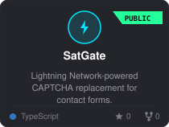
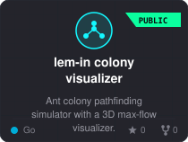
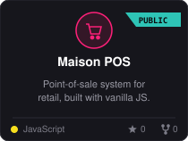
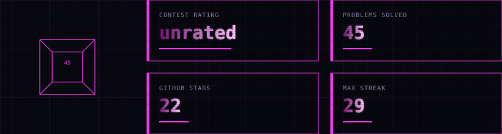

<div align="center">


<sub>~ live session · Eddy Odero@github · re-renders every build ~</sub>

   

</div>

---

### System Modules

<div align="center">


</div>

### Projects

<table>
<tr>
<td align="center" width="220">



<table><tr>
<td align="left"><br><sub>not hosted yet</sub></td>
<td align="right">[](https://github.com/Eddy-Odero/SatGate)</td>
</tr></table>

</td>
<td align="center" width="220">


<table><tr>
<td align="left"><br><sub>not hosted yet</sub></td>
<td align="right">[](https://github.com/Eddy-Odero/EDU-FLIX)</td>
</tr></table>

</td>
<td align="center" width="220">



<table><tr>
<td align="left"><br><sub>not hosted yet</sub></td>
<td align="right">[](https://github.com/Eddy-Odero/lem-in)</td>
</tr></table>

</td>
<td align="center" width="220">



<table><tr>
<td align="left"><br><sub>not hosted yet</sub></td>
<td align="right">[](https://github.com/Eddy-Odero/Maison-POS)</td>
</tr></table>

</td>
</tr>
</table>

### Dimensional Stats

<div align="center">



</div>

### A quote I like

<div align="center">


</div>

### Signal Uplink

<div align="center">

[](https://x.com/savvyoriah48) [](https://www.linkedin.com/in/eddy-odero-7b3332346/) [](https://dev.to/edd_odero) [](mailto:odiwuorodero8948@gmail.com) 
</div>

---

### `$ github --stats`

```
Repositories : 23
Stars        : 22
Followers    : 36
Contributions: 1071
Top Languages: Go, HTML, Python
Pinned       : SatGate
```

### `$ github --activity`

```
pushed to Eddy-Odero/Introduction-to-Algorithms-Go
pushed to Eddy-Odero/Introduction-to-Algorithms-Go
pushed to Eddy-Odero/Introduction-to-Algorithms-Go
pushed to Eddy-Odero/Introduction-to-Algorithms-Go
pushed to Eddy-Odero/profile-engine
```

### `$ leetcode --stats`

```
Solved       : 45 (Easy 12 / Medium 22 / Hard 11)
Rating       : unrated
Global Rank  : N/A
Top %        : N/A
Contests     : 0
Badges       : none yet
```


---

<sub>Last rendered: 2026-07-30 08:06 UTC · theme: hud · auto-generated, do not edit by hand</sub>