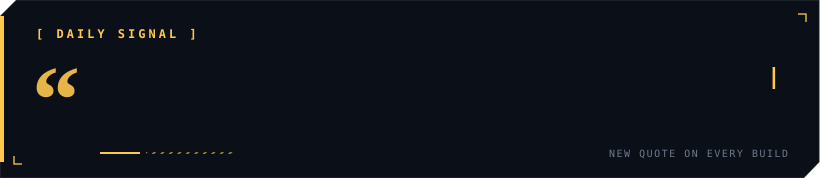
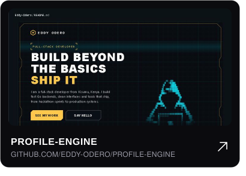

<table align="center" width="820" cellpadding="0" cellspacing="0" border="0"><tr><td align="left">
&nbsp;&nbsp;
</td></tr></table>

~ live session · Eddy Odero@github · re-renders every build ~

  

  

  

  

  

  

 

<table align="center" width="820" cellpadding="0" cellspacing="0" border="0">
<tr>
<td align="left" valign="top">

</td>
<td align="right" valign="top">

</td>
</tr>
<tr>
<td align="left" valign="top">

</td>
<td align="right" valign="top">

</td>
</tr>
</table>

  

<table align="center" width="820" cellpadding="0" cellspacing="0" border="0"><tr><td align="left">
&nbsp;&nbsp;&nbsp;&nbsp;</td></tr></table>

  

<table align="center" width="820" cellpadding="0" cellspacing="0" border="0"><tr><td align="left">
&nbsp;&nbsp;click any building to see that week's commits
</td></tr></table>

Last rendered: 2026-11-19 01:40 UTC · theme: hud · auto-generated, do not edit by hand